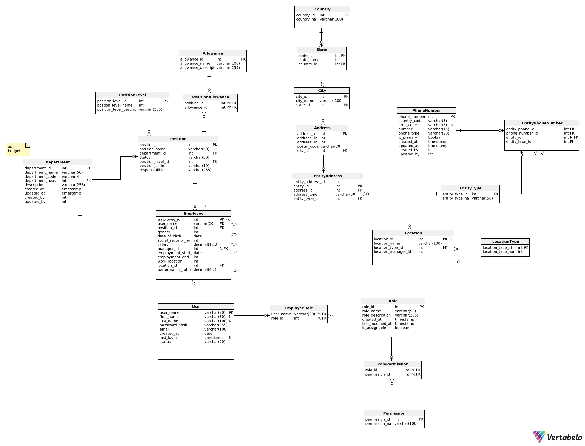

# ERP System

**Personal Project – Under Development**<br>
**Author:** Filip Dąbrowski

This repository contains my personal project: an ERP system project built with Spring Boot, Maven, and Docker. The project is a work in progress intended for personal use and experimentation. Contributions and feedback are welcome!

## Overview

The ERP system is designed to experiment with and implement basic enterprise resource planning functionalities. The current implementation includes:
- A RESTful API built with Spring Boot.
- Data persistence using Spring Data JPA.
- A PostgreSQL database managed via Docker.

## Prerequisites

Before running the project, ensure you have the following installed:
- [Docker](https://docs.docker.com/get-docker/)
- [Docker Compose](https://docs.docker.com/compose/install/)
- [Java 17](https://adoptium.net/)
- [Maven](https://maven.apache.org/install.html)

## Setup Guide
### Quick Start Using Docker Compose

1. Clone the repository:
```bash
git clone https://github.com/filipdbr/ERP_spring.git
cd erp_system
```
2. Configure the environment:

The application uses environment variables for database configuration. Fill in the provided [.env.example](./.env.example)) as follows:

```env
DATABASE_URL=jdbc:postgresql://postgres:5432/erp_db
DATABASE_USERNAME=<your-database-username>
DATABASE_PASSWORD=<your-database-password>
```
Replace <your-database-username> and <your-database-password> with your actual PostgreSQL credentials of your choice. Then rename `.env.example` to `.env`.

3. Launch the application:

In the project root directory (where the docker-compose.yml file is located), build and start the containers with:
```shell
docker-compose up -d
```

This command will:

1. Build the application Docker image.
2. Start the PostgreSQL container (named erp_postgres_db) and the application container (named erp_backend).
3. Map the PostgreSQL port (5432) and the application port (8080) to your host machine.

4. The application will be available at http://localhost:8080


### Connecting to PostgreSQL via a Client

To connect to the PostgreSQL database (for example, using DBeaver or PgAdmin4), use the following settings:

* Host: `localhost`
* Port: `5432`
* Database: `erp_db`
* Username: Use the value from your `.env` file.
* Password: Use the value from your `.env` file.

## ERP Diagram

Below is the current version of the ERP system diagram. This diagram is the first version and will be further developed as the project evolves.



### Running Locally (Without Docker):
If you prefer to run the application without Docker, ensure you have a local PostgreSQL instance configured with the same credentials as defined in your `.env` file. Adjust your application settings as needed.

## License

This project is licensed under the MIT License. See the [License](./LICENSE) file for details.
Contact

## Contributing
Contributions are welcome! Please open an issue or a pull request if you have suggestions or improvements.

For questions, suggestions, or feedback, please feel free to reach out.

