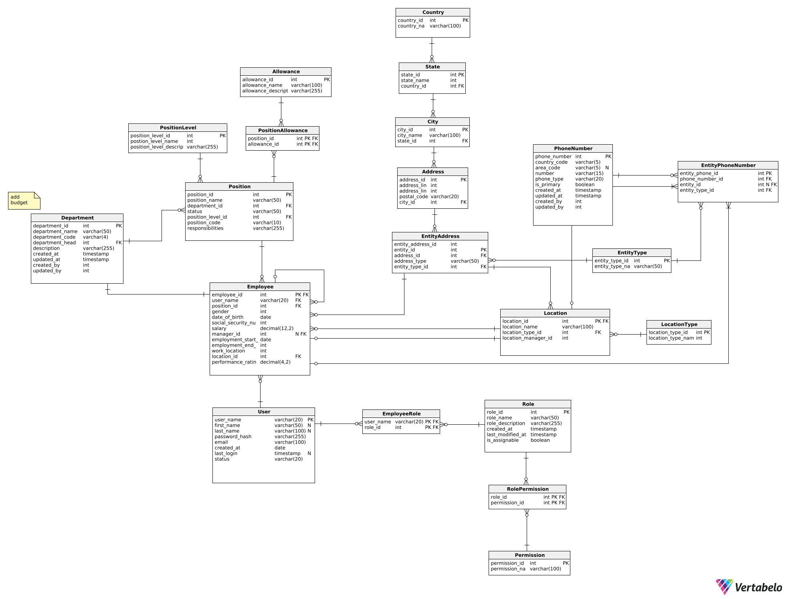

# ERP System

**Personal Project – Under Development**<br>
**Author:** Filip Dąbrowski

This repository contains my personal project: an ERP system project built with Spring Boot, Maven, and Docker. The project is a work in progress intended for personal use and experimentation. Contributions and feedback are welcome!

## Overview

The ERP system is designed to experiment with and implement basic enterprise resource planning functionalities. The current implementation includes:
- A RESTful API built with Spring Boot.
- Data persistence using Spring Data JPA.
- A PostgreSQL database managed via Docker.

## Prerequisites

Before running the project, ensure you have the following installed:
- [Docker](https://docs.docker.com/get-docker/)
- [Docker Compose](https://docs.docker.com/compose/install/)
- [Java 17](https://adoptium.net/)
- [Maven](https://maven.apache.org/install.html)

## Configuration

### Environment Variables

The application uses environment variables for database configuration. Create a `.env` file in the root directory (or copy the provided `.env.example` if available) with the following content:

```env
DATABASE_URL=jdbc:postgresql://postgres:5432/erp_db
DATABASE_USERNAME=<your-database-username>
DATABASE_PASSWORD=<your-database-password>
```
**Note**: Replace <your-database-username> and <your-database-password> with your actual PostgreSQL credentials. You can replace parameters in [.env.example](./.env.example) and rename it to `.env`.

## Running the Project
### Using Docker Compose

In the project root directory (where the docker-compose.yml file is located), build and start the containers with:
```shell
docker-compose up --build
```

This command will:

1. Build the application Docker image.
2. Start the PostgreSQL container (named erp_postgres_db) and the application container (named erp_backend).
3. Map the PostgreSQL port (5432) and the application port (8080) to your host machine.

### Connecting to PostgreSQL via a Client

To connect to the PostgreSQL database (for example, using DBeaver), use the following settings:

* Host: localhost
* Port: 5432
* Database: erp_db
* Username: Use the value from your .env file.
* Password: Use the value from your .env file.

## ERP Diagram

Below is the current version of the ERP system diagram. This diagram is the first version and will be further developed as the project evolves.



## Development Workflow

### Building the Application:
Use Maven to compile and test the project:
```shell
./mvnw clean install
```

### Running Locally (Without Docker):
If you prefer to run the application without Docker, ensure you have a local PostgreSQL instance configured with the same credentials as defined in your `.env` file. Adjust your application settings as needed.

## License

This project is licensed under the MIT License. See the [License file](./LICENSE) for details.
Contact

For questions, suggestions, or feedback, please feel free to reach out.

